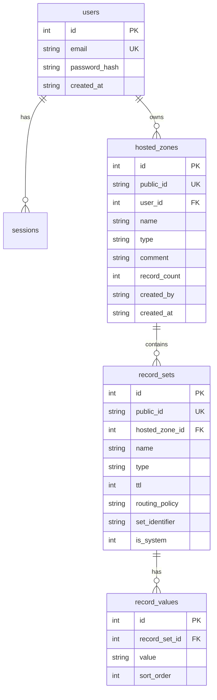

# Route53 Console Clone — Build Specification

**Project:** Functional clone of the AWS Route 53 web console
**Stack (mandated):** Next.js + TypeScript · FastAPI · SQLite
**Context:** Scaler SDE Fullstack take-home, graded submission

---

## Part 0 — How to read this document

This is the authoritative build specification. Read Parts 1–4 before writing any code; they are the standards every later section is subordinate to. If a later section conflicts with Parts 1–4, Parts 1–4 win.

Three rules govern the whole build:

1. **Originality is non-negotiable** (Part 2). Every line is written from this spec, not copied from anywhere.
2. **Readability beats sophistication** (Part 3). A reviewer must understand any file in under two minutes.
3. **UI/UX excellence is the default, not a phase** (Part 4). Every screen, including placeholders and error states, is designed.

Work through the phases in Part 14 in order. Do not skip ahead to features when foundations are incomplete.

---

## Part 1 — Mission and non-negotiables

Build a web application that a reviewer opening the hosted demo mistakes for the AWS Route 53 console, backed by an API and database that a senior engineer would approve in code review.

**The grading rubric, in stated priority order:** UI similarity to Route 53 · frontend engineering quality · backend/API design · database design · code quality and maintainability · documentation · overall completeness.

UI similarity is listed first. Weight effort accordingly — but never by sacrificing the correctness of the other six.

### Non-negotiables

| # | Requirement |
|---|---|
| 1 | Every line of code is original work written from this spec (Part 2). |
| 2 | Any file is comprehensible to a reviewer in under two minutes (Part 3). |
| 3 | Every screen is deliberately designed, including empty, loading, error, and placeholder states (Part 4). |
| 4 | `PRAGMA foreign_keys = ON` is set on every connection. SQLite disables it by default. |
| 5 | Every query touching user data filters by owner in the SQL `WHERE` clause. Never filter after fetch. |
| 6 | A cross-user access attempt returns `404`, not `403`. A test proves this. |
| 7 | No secret exists as a string literal anywhere in the repository, at any point in git history. |
| 8 | Record sets are unique on `(hosted_zone_id, name, type, set_identifier)`, enforced by a database constraint. |
| 9 | All nine required record types validate correctly server-side before persistence. |
| 10 | The README, ER diagram, and ADRs are complete and accurate at submission. |

---

## Part 2 — Originality and attribution charter

The submission must be defensibly, verifiably your own work. This section defines what that means in practice.

### 2.1 Absolute prohibitions

- **Do not consult or reproduce any existing Route 53 clone, DNS-manager clone, or similar tutorial project.** Not for structure, not for naming, not for "inspiration." Build from this specification alone.
- **Do not copy code from Stack Overflow answers, blog posts, or documentation examples verbatim.** Read a doc to understand an API, then write your own implementation in your own structure.
- **Do not lift AWS trademarked assets.** No AWS logos, no Amazon wordmarks, no downloaded AWS icon SVGs, no copied AWS documentation prose in the UI or README. Replicating a *layout and interaction pattern* is the assignment; copying *protected assets* is a legal problem, not a style choice. Use a neutral text mark or an original logomark in the brand slot.
- **Do not paste AWS help-panel copy.** Where the real console shows explanatory text, write your own shorter equivalent in your own voice.

### 2.2 What is legitimately not plagiarism

Be clear on the distinction, because over-caution here would be as damaging as under-caution:

- **Declared open-source dependencies are not plagiarism.** Installing `@cloudscape-design/components` (Apache 2.0), FastAPI, SQLAlchemy, or TanStack Query and listing them in `package.json` / `pyproject.toml` is ordinary engineering. Cloudscape is AWS's own design system, open-sourced in July 2022 under Apache 2.0 precisely so that people can build with it.
- **Replicating an interaction pattern is the assignment.** The brief explicitly asks for an application resembling Route 53 in navigation, tables, forms, search, filters, pagination, modals, and notifications. Recreating those patterns is compliance, not copying.
- **Code generated from your own OpenAPI schema is your work.** A generated TypeScript client derived from your own API definition is a build artifact of your own design.

### 2.3 Required attribution mechanisms

- Add a **Third-party dependencies** section to the README listing each significant dependency, its license, and one line on why it was chosen.
- Write **ADR-0001** justifying the Cloudscape decision in your own reasoning, including alternatives rejected and trade-offs accepted. This converts a dependency choice into documented engineering judgment.
- Add a **short disclaimer** to the README: this is an educational UI/UX clone built for an assignment, unaffiliated with and not endorsed by Amazon Web Services, implementing no actual DNS resolution.
- Mark the generated API client directory with a header comment stating it is generated from `openapi.json` and must not be hand-edited.

### 2.4 Originality signals a reviewer can verify

- **Commit history that shows the work happening.** Many small, coherent Conventional Commits (`feat:`, `fix:`, `refactor:`, `test:`, `docs:`) in a sensible order. A repository arriving in three enormous commits reads as imported.
- **ADRs recording decisions and rejected alternatives.** Copied projects have no decision trail.
- **A "Known limitations and trade-offs" README section** naming what you consciously did not build and why. This is the strongest authorship signal available, and almost no candidate includes it.
- **Comments that explain reasoning at genuine decision points** — why a constraint exists, why a rule is enforced at this layer. Not comments restating what the line does.

---

## Part 3 — Readability charter and complexity budget

The brief grades "code quality and maintainability," not architectural ambition. A reviewer spends limited time in your repository; ceremony they must decode counts against you. Optimize for a reader, not for a pattern catalogue.

### 3.1 Standards

- **Two-minute rule.** Any file a reviewer opens should be understandable in under two minutes. If it isn't, it is too long, too clever, or doing too many things.
- **Boring, explicit names.** `create_hosted_zone`, `validate_record_value`, `HostedZoneTable`. No abbreviations beyond universally known ones. No `mgr`, `svc`, `hdlr`, `utils2`.
- **Functions do one thing.** Target under 30 lines; 50 is the hard ceiling. If a function needs section-header comments inside it, split it.
- **One concept per file.** Target under 200 lines; 300 is the ceiling.
- **Shallow nesting.** Maximum three levels. Use early returns and guard clauses instead of `else` pyramids.
- **Comments justify, they don't narrate.** Explain *why* — why CNAME cannot sit at the apex, why the pragma is required, why this returns 404 rather than 403. Never `# increment the counter`.
- **Type everything.** Python: full annotations, `mypy` clean. TypeScript: `strict` plus `noUncheckedIndexedAccess`. No `any`; no `# type: ignore` without an adjacent explanatory comment.
- **Docstrings on every public function, class, and module.** Two to four lines: purpose, non-obvious parameters, what it raises. Not prose essays.
- **No dead code.** No commented-out blocks, no unused imports, no `TODO` referencing unfinished security work, no debug prints, no test-only endpoints.
- **Consistency outranks personal preference.** Pick conventions in Phase 0, apply everywhere, enforce with `ruff` and `eslint`/`prettier`.

### 3.2 Complexity budget — build these

These abstractions earn their cost and directly serve the "loosely coupled" requirement:

- **Repository protocols.** `Protocol` interfaces in `repositories/protocols.py`, SQLAlchemy implementations behind them. This is the loose-coupling story: services depend on interfaces, persistence is swappable, unit tests mock the protocol. Keep interfaces small and obvious.
- **Separate Pydantic schemas from SQLAlchemy models.** Input schemas, output schemas, and ORM entities are distinct types. This simultaneously prevents mass-assignment vulnerabilities and over-serialization.
- **A service layer holding business rules.** DNS validation orchestration, record-set uniqueness, CNAME coexistence, system-record immutability. Routers stay thin.
- **A pure domain module.** `domain/dns_rules.py` with no framework imports — plain functions, trivially testable.
- **A generated TypeScript client from your OpenAPI schema.** This *reduces* hand-written code while making frontend/backend drift a compile error. Complexity that removes work.

### 3.3 Complexity budget — do not build these

Explicitly forbidden. Each was considered and rejected as ceremony at this scale:

- **No dependency-injection container.** FastAPI's `Depends` is sufficient and idiomatic. `dependency-injector` / `wireup` / `svcs` add indirection a reviewer must learn.
- **No separate UnitOfWork class.** A session-per-request dependency with an explicit commit in the service achieves the same atomicity with less machinery. Say so in an ADR.
- **No event bus, no CQRS, no message queue.** There are no asynchronous workflows here.
- **No FTS5 virtual tables.** Indexed `LIKE` queries are correct at this data volume. Document FTS5 as the scale path in the README — knowing when *not* to reach for a tool is the signal.
- **No audit-log table.** Interesting, unrequested, and it complicates every write path. Mention it under future work.
- **No caching layer.** No Redis, no in-memory cache. Nothing here is slow.
- **No custom ORM wrappers or base-repository generics.** Concrete repositories with explicit methods read better than a generic `BaseRepository[T, ID]` a reviewer must mentally instantiate.
- **No Storybook.** Real cost, no rubric credit.
- **No microservices, no GraphQL layer, no server-rendering heroics.** The mandated stack, used well.
- **No premature abstraction.** Two similar functions are fine. Abstract at the third occurrence, not the second.

When tempted by an abstraction not on the build list, choose the simpler option and note the reasoning in an ADR or comment. Demonstrated restraint is a senior signal.

---

## Part 4 — UI/UX excellence mandate

UI similarity to Route 53 is the first grading criterion. Treat design quality as a standing requirement on every screen, not a polish phase that might get cut.

### 4.1 Division of responsibility

**Cloudscape owns structural fidelity.** Use `@cloudscape-design/components` for the console shell and data-heavy surfaces, because these are exactly what "UI similarity to Route 53" measures, and Cloudscape *is* the design system the real console is built from — created at AWS in 2016, open-sourced July 2022, and per Amazon Design now supporting 220+ AWS products. Use it for: `AppLayout`, `SideNavigation`, `TopNavigation`, `Table` (with `@cloudscape-design/collection-hooks`), `TextFilter` / `PropertyFilter`, `Pagination`, `CollectionPreferences`, `Form` / `FormField`, `Input` / `Select` / `Textarea`, `Modal`, `Flashbar`, `Tabs`, `BreadcrumbGroup`, `Header`, `HelpPanel`, `Button` / `ButtonDropdown`, `SpaceBetween`, `ColumnLayout`, `StatusIndicator`.

**The design skill owns everything Cloudscape does not dictate.** Cloudscape gives you correct console chrome; it does not give you *good design judgment*, and the surfaces below are where your own UI/UX quality becomes visible to a reviewer. Invoke the design skill for:

- **The login screen.** Outside the console shell entirely — a blank canvas. Make it genuinely well designed: composition, type scale, spacing rhythm, brand mark, focus states, error presentation.
- **The Coming Soon placeholder pages.** Five of them. Lazy placeholders are a visible quality tell; a beautifully composed empty state signals care. Design one excellent reusable pattern with an original illustration or geometric motif.
- **The Dashboard placeholder.** The most likely first landing screen. Make it look intentional.
- **Empty states** for zero hosted zones and zero records — illustration, one clear sentence, one primary action.
- **Loading skeletons** matching final content dimensions so nothing shifts on load.
- **Error and 404 states.** Designed, not raw stack text.
- **Dark mode polish.** Cloudscape provides the mode switch via `applyMode`; verify contrast, elevation, and illustration behaviour in both themes.
- **Micro-interactions and motion.** Hover, focus, active, transitions, notification entry and exit. Subtle and consistent — respect `prefers-reduced-motion`.
- **Information hierarchy.** Where headers, descriptions, counts, and actions sit on each page; what is primary versus secondary; what earns emphasis.

### 4.2 Standing UX requirements

- **Every state is designed.** Loading, empty, error, partial, success, disabled. No screen may render as a bare spinner or unstyled text.
- **Every destructive action confirms.** A modal naming the specific resource, with the destructive button visually distinguished.
- **Every mutation notifies.** A `Flashbar` message on success and on failure. Dismissible, stacked, non-blocking.
- **Table state lives in the URL.** Search, filter, sort, and page are query parameters, so a view is shareable and the back button behaves. Reviewers notice this immediately.
- **Forms validate inline, on blur, with helpful messages.** Not a single error summary on submit. Per-record-type value hints, matching the real console.
- **Nothing shifts on load.** Reserve space; use dimension-matched skeletons.
- **Keyboard accessible throughout.** Visible focus rings, logical tab order, `Escape` closes modals, `Enter` submits forms.
- **Accessible by default.** Semantic HTML, labelled controls, WCAG AA contrast in both themes, `axe` clean. Verify with `@axe-core/playwright` in CI.
- **Responsive down to tablet.** The real console is desktop-first; degrade gracefully rather than perfectly.

### 4.3 Backend and database excellence — the parallel mandate

The same standard applies where a reviewer reads rather than sees:

- **Every endpoint** has correct status codes, a declared `response_model`, documented error cases, and OpenAPI `tags` / `summary` / examples.
- **Every error** returns RFC 9457 Problem Details with a correlation ID, and never a stack trace, SQL fragment, or file path.
- **Every business rule** is enforced server-side regardless of client validation, and covered by a test.
- **Every constraint that can live in the schema, lives in the schema** — `NOT NULL`, `CHECK`, `UNIQUE`, foreign keys with explicit `ON DELETE`. Application-only invariants are a loophole.
- **Every table** has deliberate indexes justified by an actual query, correct types, and a documented purpose.
- **`/docs` is a deliverable.** A reviewer will open it. It should read like published API documentation.

---

## Part 5 — Technology decisions

Each row is ADR source material. Record the decision, the alternatives, and the trade-off accepted.

| Decision | Choice | Rejected | Rationale |
|---|---|---|---|
| Frontend | Next.js App Router + TypeScript | — | Mandated. Nested layouts mirror the console shell. |
| Component library | Cloudscape | Tailwind hand-build, MUI, shadcn/ui | It is the console's own design system; maximal fidelity on criterion #1. |
| Custom design surfaces | Design skill (Part 4.1) | Cloudscape defaults everywhere | Demonstrates independent UI judgment where Cloudscape is silent. |
| Backend | FastAPI | — | Mandated. Pydantic v2 validation, automatic OpenAPI. |
| ORM | SQLAlchemy 2.0, typed `Mapped[]` | SQLModel, raw SQL | Parameterized by construction, Alembic integration, explicit typing. |
| Migrations | Alembic with `render_as_batch=True` | Hand-written SQL, none | SQLite lacks `ALTER COLUMN`; batch mode emulates via table rebuild. |
| Database | SQLite, WAL mode | — | Mandated. Pragmas make it production-credible. |
| Backend structure | Routers → services → repository protocols; pure domain module | Fat routers, active record, hexagonal with DI container | Loose coupling without ceremony (Part 3). |
| Concurrency | Sync SQLAlchemy in FastAPI's threadpool (`def` endpoints) | `aiosqlite` | SQLite serializes writers; sync avoids async foot-guns at no real cost. Document in an ADR. |
| API client | `@hey-api/openapi-ts` generating a typed client | Hand-written fetch wrappers, Orval | Contract drift becomes a compile error; less hand-written code. |
| Server state | TanStack Query v5 | SWR, server actions only | Cache invalidation, optimistic updates, post-mutation notifications. |
| URL state | `nuqs` | Raw `searchParams`, Zustand | Shareable, back-button-correct table state with minimal code. |
| Forms | React Hook Form + Zod resolver | Formik, uncontrolled | Discriminated-union schema per record type. |
| Auth | Opaque session in `httpOnly` + `Secure` + `SameSite=Lax` cookie; Argon2 hashing | JWT in `localStorage` | Correct for a browser app; Argon2 keeps "mocked" from meaning "insecure". |
| Frontend host | Vercel | Netlify, Cloudflare Pages | First-party Next.js hosting, zero configuration. |
| Backend host | Fly.io with a persistent volume | Render / Railway free tiers | Free web instances have ephemeral filesystems — SQLite is wiped on every restart, redeploy, or spin-down. A volume is mandatory. |
| Persistence fallback | Turso / libSQL | LiteFS, Litestream | SQLite-compatible managed drop-in; one connection-string change. |
| Tooling | Ruff + mypy (Python); ESLint flat + Prettier (TS) | Biome | Standard, fast, well understood. |
| Tests | pytest; Vitest + React Testing Library; Playwright | Jest, Cypress, MSW | Sufficient coverage without extra layers. MSW cut as redundant. |

---

## Part 6 — Repository structure

```
route53-clone/
├── README.md
├── docs/
│   ├── adr/                       # 0001-ui-component-library.md, 0002-layering.md, ...
│   ├── diagrams/                  # er-diagram.mmd, architecture.mmd
│   └── SECURITY.md
├── docker-compose.yml
├── .github/workflows/ci.yml
├── .gitleaks.toml
├── .pre-commit-config.yaml
├── .env.example
│
├── frontend/
│   ├── src/
│   │   ├── app/
│   │   │   ├── layout.tsx                  # root: global styles, providers
│   │   │   ├── (auth)/login/page.tsx       # designed surface
│   │   │   └── (console)/
│   │   │       ├── layout.tsx              # console shell (client)
│   │   │       ├── dashboard/page.tsx
│   │   │       ├── hosted-zones/
│   │   │       │   ├── page.tsx
│   │   │       │   └── [zoneId]/
│   │   │       │       ├── page.tsx
│   │   │       │       └── records/page.tsx
│   │   │       ├── health-checks/page.tsx
│   │   │       ├── traffic-policies/page.tsx
│   │   │       ├── resolver/page.tsx
│   │   │       └── profiles/page.tsx
│   │   ├── components/
│   │   │   ├── shell/                      # ConsoleShell, AppSideNavigation, AppTopNavigation
│   │   │   ├── hosted-zones/               # HostedZoneTable, HostedZoneForm, DeleteZoneModal
│   │   │   ├── records/                    # RecordTable, RecordForm, RecordValueField
│   │   │   └── ui/                         # designed: EmptyState, ComingSoon, TableSkeleton, ErrorState
│   │   ├── lib/
│   │   │   ├── api/                        # GENERATED — do not edit
│   │   │   ├── queries/                    # TanStack Query hooks + key factory
│   │   │   ├── schemas/                    # Zod, record-type discriminated union
│   │   │   └── notifications.ts            # Flashbar store
│   │   ├── providers.tsx
│   │   └── middleware.ts                   # CSP nonce, security headers, auth gate
│   ├── e2e/
│   ├── next.config.ts
│   └── openapi-ts.config.ts
│
└── backend/
    ├── app/
    │   ├── main.py                         # app factory, middleware, exception handlers
    │   ├── core/
    │   │   ├── config.py                   # pydantic-settings
    │   │   ├── database.py                 # engine, pragmas, session dependency
    │   │   ├── security.py                 # Argon2, sessions, CSRF
    │   │   ├── logging.py                  # structlog + correlation ID
    │   │   └── errors.py                   # exceptions → RFC 9457 handlers
    │   ├── api/v1/
    │   │   ├── router.py
    │   │   ├── dependencies.py             # session, current_user
    │   │   ├── auth.py
    │   │   ├── hosted_zones.py
    │   │   ├── records.py
    │   │   └── zone_files.py               # BIND import/export (bonus)
    │   ├── schemas/                        # Pydantic DTOs
    │   ├── models/                         # SQLAlchemy entities
    │   ├── repositories/
    │   │   ├── protocols.py                # Protocol interfaces
    │   │   └── sqlalchemy/
    │   ├── services/                       # business rules
    │   ├── domain/
    │   │   ├── dns_rules.py                # pure, framework-free
    │   │   └── zone_file.py                # BIND parse/serialize
    │   └── seed.py
    ├── alembic/
    ├── tests/
    │   ├── unit/
    │   └── integration/
    ├── pyproject.toml
    └── Dockerfile                          # multi-stage, non-root
```

---

## Part 7 — Database design

### 7.1 The central modelling decision

Route 53 groups multiple values under a single **record set** keyed by name and type. AWS documents that you cannot create a CNAME named `www` alongside an A record named `www`, and weighted or multivalue records share a name and type while differing by set identifier. Therefore: **one row per record set, values in a child table**, with a uniqueness constraint on `(hosted_zone_id, name, type, set_identifier)`.

Modelling one row per *value* would be the single most consequential design error available here. Explain this decision in ADR-0003 — it is the clearest evidence of domain understanding in the whole submission.

### 7.2 Schema

**`users`**
`id` INTEGER PK · `email` TEXT NOT NULL UNIQUE COLLATE NOCASE · `password_hash` TEXT NOT NULL · `created_at` TEXT NOT NULL DEFAULT (datetime('now'))

**`sessions`**
`id` TEXT PK (hash of the opaque token; never store the token itself) · `user_id` INTEGER NOT NULL REFERENCES `users(id)` ON DELETE CASCADE · `expires_at` TEXT NOT NULL · `created_at` TEXT NOT NULL DEFAULT (datetime('now'))
Index: `ix_sessions_user (user_id)`

**`hosted_zones`**
`id` INTEGER PK · `public_id` TEXT NOT NULL UNIQUE (Route 53-style, `Z` + base32) · `user_id` INTEGER NOT NULL REFERENCES `users(id)` ON DELETE CASCADE · `name` TEXT NOT NULL COLLATE NOCASE · `type` TEXT NOT NULL CHECK (`type` IN ('Public','Private')) · `comment` TEXT (displayed as "Description") · `record_count` INTEGER NOT NULL DEFAULT 2 · `created_by` TEXT NOT NULL DEFAULT 'Route 53 Console' · `created_at` TEXT NOT NULL DEFAULT (datetime('now')) · `updated_at` TEXT
Constraints: UNIQUE (`user_id`, `name`) · Indexes: `ix_zones_user (user_id)`, `ix_zones_name (name)`

**`record_sets`**
`id` INTEGER PK · `public_id` TEXT NOT NULL UNIQUE · `hosted_zone_id` INTEGER NOT NULL REFERENCES `hosted_zones(id)` ON DELETE CASCADE · `name` TEXT NOT NULL COLLATE NOCASE · `type` TEXT NOT NULL CHECK (`type` IN ('A','AAAA','CNAME','TXT','MX','NS','PTR','SRV','CAA','SOA')) · `ttl` INTEGER NOT NULL CHECK (`ttl` BETWEEN 0 AND 2147483647) · `routing_policy` TEXT NOT NULL DEFAULT 'Simple' · `set_identifier` TEXT · `is_system` INTEGER NOT NULL DEFAULT 0 CHECK (`is_system` IN (0,1)) · `created_at` TEXT NOT NULL DEFAULT (datetime('now')) · `updated_at` TEXT
Constraints: **UNIQUE (`hosted_zone_id`, `name`, `type`, `set_identifier`)** · Index: `ix_records_zone_name_type (hosted_zone_id, name, type)`

**`record_values`**
`id` INTEGER PK · `record_set_id` INTEGER NOT NULL REFERENCES `record_sets(id)` ON DELETE CASCADE · `value` TEXT NOT NULL · `sort_order` INTEGER NOT NULL DEFAULT 0
Index: `ix_values_record_set (record_set_id)`

Internal integer primary keys stay internal. Expose only `public_id` in the API and UI — this avoids leaking sequential identifiers and mirrors Route 53's `Z...` zone IDs.

### 7.3 Required pragmas

Set these on every connection via a SQLAlchemy `connect` event listener:

```
PRAGMA journal_mode = WAL;     -- reader/writer concurrency; persists on the file
PRAGMA synchronous  = NORMAL;  -- correct pairing with WAL
PRAGMA foreign_keys = ON;      -- OFF BY DEFAULT IN SQLITE — the classic loophole
PRAGMA busy_timeout = 5000;    -- avoids spurious "database is locked"
PRAGMA temp_store   = MEMORY;
```

The SQLite documentation is explicit that foreign key constraints are disabled by default for backwards compatibility and must be enabled per connection, advising that careful developers enable or disable them explicitly rather than assuming. Add a comment saying so, and mention it in the README — it demonstrates you understand your database rather than merely using it.

### 7.4 Migrations and seeding

Alembic with `render_as_batch=True`. Every schema change ships as a migration; never mutate tables by hand. Seeding is idempotent and safe to run on boot, producing a demo user plus several realistic hosted zones with a spread of record types, so a reviewer never lands on an empty application.

### 7.5 ER diagram



---

## Part 8 — API design

Versioned under `/api/v1`. Errors use RFC 9457 Problem Details (`application/problem+json`) with a correlation ID and no internal detail. List endpoints return `{ items, total, next_token }` — `total` because the table's pagination needs it, `next_token` because Route 53's own list APIs are token-paginated.

### Authentication

| Method | Path | Request | Responses |
|---|---|---|---|
| POST | `/auth/login` | `{ email, password }` | `200` + session cookie; `401` generic; `429` rate-limited |
| POST | `/auth/logout` | — | `204`, cookie cleared, session row deleted |
| GET | `/auth/me` | — | `200 { user }`; `401` — drives session persistence |

### Hosted zones

| Method | Path | Notes |
|---|---|---|
| GET | `/hosted-zones` | `?search=&sort=&order=&limit=&offset=` — owner-scoped |
| POST | `/hosted-zones` | `201`; auto-creates SOA + apex NS system records in one transaction; `409` duplicate; `422` invalid |
| GET | `/hosted-zones/{public_id}` | `200`; `404` if absent **or not owned** |
| PATCH | `/hosted-zones/{public_id}` | `{ comment? }` → `200`; `404` |
| DELETE | `/hosted-zones/{public_id}` | `204`; `404`; `409` if non-system records remain |

### Records

| Method | Path | Notes |
|---|---|---|
| GET | `/hosted-zones/{zid}/records` | `?search=&type=&sort=&limit=&offset=` |
| POST | `/hosted-zones/{zid}/records` | Type-discriminated body; `201`; `409` on uniqueness, CNAME coexistence, or apex CNAME; `422` per-type validation |
| GET | `/hosted-zones/{zid}/records/{rid}` | `200`; `404` |
| PUT | `/hosted-zones/{zid}/records/{rid}` | `200`; `409`; `422`; rejects edits to system records |
| DELETE | `/hosted-zones/{zid}/records/{rid}` | `204`; `409` if `is_system` |

### Zone files (bonus)

| Method | Path | Notes |
|---|---|---|
| POST | `/hosted-zones/{zid}/import` | Multipart BIND file → `200 { created, skipped, errors[] }`. **Highest-risk input surface — see Part 13.** |
| GET | `/hosted-zones/{zid}/export?format=json\|bind` | File download |

### Operations

`GET /healthz` → `200` with a database ping, for the host's health check. `/docs` and `/redoc` are disabled or gated in production via a settings flag.

**Documentation quality:** per-router `tags`, a `summary` and `description` on every operation, explicit `response_model` plus a `responses={}` map covering error cases, realistic examples, and `generate_unique_id_function=lambda route: route.name` so the generated client has clean method names.

---

## Part 9 — Backend layering

Four layers, each with one job. Dependencies point inward only.

**1. Routers (`api/v1/`).** Thin. Parse the request DTO, call a service via `Depends`, return a `response_model`. No business logic, no ORM access, no `try/except` around business rules — exception handlers own error translation.

**2. Services (`services/`).** All business rules: DNS validation orchestration, record-set uniqueness, CNAME coexistence and apex prohibition, system-record immutability, `record_count` maintenance, SOA and NS auto-creation. Depend only on repository *protocols*, never on concrete implementations. Raise domain exceptions; never return HTTP concerns.

**3. Repositories (`repositories/`).** `protocols.py` defines `Protocol` interfaces; `sqlalchemy/` implements them. Every method reading user-owned data takes an owner identifier and applies it in the `WHERE` clause. This is both the loose-coupling mechanism and the authorization mechanism.

**4. Domain (`domain/`).** Pure functions. No FastAPI, no SQLAlchemy, no I/O. DNS validation rules and BIND parsing live here and are unit-tested in isolation.

**Cross-cutting.** Correlation-ID middleware, structlog JSON logging with credential redaction, exception handlers mapping domain exceptions to RFC 9457 responses, CORS with an explicit origin allowlist, security headers, and rate limiting on authentication.

**Transactions.** One session per request via `Depends`; FastAPI caches the dependency so every repository in a request shares it. Services commit explicitly at the end of a successful operation; the dependency rolls back on exception. Multi-step writes — creating a zone with its SOA and NS records — are therefore atomic without a UnitOfWork class.

**Anti-drift.** CI starts the backend, exports `openapi.json`, and regenerates the frontend client. A breaking contract change fails the frontend typecheck. Highlight this in the README as the concrete mechanism behind "loosely coupled."

---

## Part 10 — Frontend architecture

**Routing.** An `(auth)` route group for login and a `(console)` group whose layout renders the console shell, so every authenticated page inherits it. Routes mirror the resource hierarchy: `/hosted-zones`, `/hosted-zones/[zoneId]`, `/hosted-zones/[zoneId]/records`, plus the five placeholder routes.

**Client boundaries.** Cloudscape components are client-only — they use DOM APIs and `useLayoutEffect`. Mark the shell and any interactive page `"use client"`. Set `transpilePackages: ['@cloudscape-design/components', '@cloudscape-design/component-toolkit']` in `next.config.ts`, and import `@cloudscape-design/global-styles/index.css` exactly once in the root layout, since Next.js forbids importing global CSS from `node_modules` inside components.

**The AppLayout constraint.** `AppLayout` accepts `content`, `navigation`, and `tools` as props rather than rendering `{children}`. Resolve this by implementing `ConsoleShell` as a client component that receives the route's `children` and passes them into `AppLayout`'s `content` prop. Address this integration on day one of Phase 2 — it is the build's main technical unknown.

**Data layer.** The generated client wrapped in TanStack Query hooks, with a query-key factory in `lib/queries/`. Mutations invalidate the relevant keys, apply optimistic updates where the correct outcome is predictable, and push a `Flashbar` notification on settle.

**Table state.** Search, filter, sort, and pagination live in the URL via `nuqs`, feeding Cloudscape's `useCollection` from `@cloudscape-design/collection-hooks`.

**Forms.** React Hook Form with a Zod resolver. Record values use a **discriminated union keyed on record type**, so choosing MX validates preference-and-exchange while choosing SRV validates priority-weight-port-target, with no branching soup in the component. Mirror the server rules in Part 12 — the server remains authoritative.

**Notifications.** A single small store feeding one `Flashbar` in the shell. Mutations publish; the shell renders.

**Error handling.** A React error boundary per route segment, designed error states, and no raw error objects reaching the user.

---

## Part 11 — Screen specification

### Console shell

`TopNavigation` with the app mark (original, not an AWS asset), a service-search input, a decorative region selector, and a user menu containing Logout. Below it, `AppLayout` with `SideNavigation`.

**Side navigation — replicate these labels and this order.** Functional items are marked; all others render the designed Coming Soon page.

- Dashboard
- **Hosted zones** *(functional)*
- Health checks
- IP-based routing
- Traffic flow → Traffic policies, Policy records
- Domains → Registered domains, Pending requests
- Resolver → VPCs, Inbound endpoints, Outbound endpoints, Rules, Query logging, DNS Firewall
- Applications, Profiles

### Hosted zones list — `/hosted-zones`

Cloudscape `Table`, columns: **Hosted zone name · Type · Created by · Record count · Description · Hosted zone ID**. Radio single-row selection, matching the console's single-select pattern. Search box, `Pagination`, and a `CollectionPreferences` gear for page size and visible columns. Primary button **Create hosted zone**; secondary **Edit**, **Delete**, **View details**, enabled on selection. Designed empty state and dimension-matched skeleton.

### Create hosted zone

`FormField`s for **Domain name**, **Description**, and **Type** (radio: Public hosted zone / Private hosted zone), with a `HelpPanel` on the right carrying your own explanatory copy. On success: invalidate, notify, navigate to the new zone.

### Hosted zone detail — `/hosted-zones/[zoneId]`

`BreadcrumbGroup` (Hosted zones / example.com.). `Tabs`: **Records**, **Hosted zone details**, **Tags**, and a decorative **DNSSEC signing** tab. The details tab shows the auto-created SOA and NS values read-only.

### Records table — `/hosted-zones/[zoneId]/records`

Columns: **Record name · Type · Routing policy · Differentiator · Alias · Value/Route traffic to · TTL (seconds) · Health check ID · Evaluate target health · Record ID**. Search, type filter, pagination, gear. **Create record** primary; **Edit**, **Delete**, **View details** secondary. System SOA and apex NS rows render normally but with Delete disabled and a tooltip explaining why.

### Create record

Replicate the console's **Quick create** view with a **Switch to wizard** toggle. Fields: **Routing policy** (default Simple routing) · **Record name** with the zone suffix shown inline · **Record type** (A – IPv4 address, AAAA, CNAME, TXT – Text, MX, NS, PTR, SRV, CAA) · **Value** as a textarea, one value per line, with per-type placeholder and hint text · **TTL (seconds)** with presets 1 minute (60), 5 minutes (300), 1 hour (3600), 1 day (86400) plus custom entry, defaulting to 300. An **Add another record** button stages additional records; the submit button reads **Create records**.

### Placeholder pages

One designed, reusable Coming Soon component (Part 4.1) taking a title and description. Never a bare heading.

---

## Part 12 — DNS validation matrix

Rules live in `domain/dns_rules.py` as pure functions, are enforced by Pydantic discriminated unions at the API boundary, and are mirrored in Zod for client-side UX. The server is always authoritative.

**Global name handling.** Lowercase; normalize to a single trailing dot; convert internationalized names to punycode; enforce label length ≤ 63 and FQDN length ≤ 255; permit `*` only as the leftmost label; permit leading underscores for service labels such as `_sip._tcp` and `_dmarc`. TTL 0–2147483647 for every type.

| Type | Value rule | Route 53 constraint |
|---|---|---|
| **A** | IPv4 dotted quad; validate with `ipaddress.IPv4Address` | Multiple values allowed, one per line |
| **AAAA** | IPv6 including compressed `::`; validate with `ipaddress.IPv6Address` — never a hand-rolled regex | Multiple values allowed |
| **CNAME** | Exactly one hostname value, trailing dot | **Cannot coexist with any other record set at the same name; cannot exist at the zone apex.** Enforce both in the service layer |
| **TXT** | One or more quoted character-strings, each ≤ 255 bytes; chunk longer strings; escape embedded quotes | Validate quoting and per-string length |
| **MX** | `preference exchange` — integer 0–65535 plus a hostname with trailing dot; the exchange must be a hostname, never an IP or a CNAME target | Multiple values allowed |
| **NS** | One hostname per value, trailing dot | Apex NS records are auto-created (four nameservers) and **cannot be deleted** |
| **PTR** | A hostname value with trailing dot | Standard validation |
| **SRV** | `priority weight port target` — three integers 0–65535 plus a target hostname; name conventionally `_service._proto` | Multiple values allowed |
| **CAA** | `flags tag value` — flags 0–255, tag ∈ {`issue`, `issuewild`, `iodef`}, value quoted | Allowlist the tag; `issue`/`issuewild` take a CA domain, `iodef` takes a `mailto:` or URL |
| **SOA** | Generated on zone creation; read-only in the UI | Exactly one per zone; cannot be deleted |

AWS documents that Route 53 automatically creates an NS record listing four name servers plus an SOA record for every public hosted zone, and that a CNAME cannot be created at the zone apex. Encoding both rules — and surfacing them correctly in the UI — is what makes this a Route 53 clone rather than a CRUD form over a records table.

**Zone-file handling (bonus).** `domain/zone_file.py` supports RFC 1035 master-file format: `$ORIGIN`, `$TTL`, `@` as the current origin, implicit owner-name inheritance from the previous line, the `IN` class field, parenthesized multi-line records, `;` comments, and relative versus absolute names. **`$INCLUDE` must be explicitly rejected** — it is a local-file-read primitive. See Part 13.

---

## Part 13 — Security

Structured against the OWASP Top 10 and API Security Top 10, and mapped from the five-prompt audit guide onto this stack. The guide assumes Express, Supabase, and Stripe; the translations below adapt it to FastAPI, SQLite, and Next.js with mocked authentication and no payments.

### 13.1 Timing

The guide frames these as pre-launch checks. Do not wait.

- **From commit one, continuously:** secret scanning and dependency auditing in pre-commit and CI. Secrets are cheapest to prevent and impossible to fully retract from a public repository once pushed.
- **At every phase boundary:** data-flow review, authorization review, and the attacker's-perspective pass.
- **Before submission:** a full sweep against the checklist in 13.6.

Record this reasoning in `docs/SECURITY.md`.

### 13.2 Secrets

Run `gitleaks` and `detect-secrets` in pre-commit and CI. Keep all configuration in `pydantic-settings` reading from the environment; commit `.env.example` with placeholders; list `.env` in `.gitignore`; enable GitHub secret scanning and push protection. In Next.js, only genuinely public values may carry the `NEXT_PUBLIC_` prefix — session secrets and database URLs must never appear with it. If a secret ever reaches git history, rotation alone is insufficient: history must be rewritten.

### 13.3 Authorization — the primary risk

Broken object-level authorization is the top item on the OWASP API list and the most likely real vulnerability in this application.

- Every repository method reading user-owned data takes an owner identifier and applies it **in the SQL `WHERE` clause**. Never fetch then filter.
- Cross-user access returns **`404`, not `403`** — a 403 confirms the resource exists.
- **Write the test.** An integration test where user B requests user A's zone and record, asserting 404 on both, is the single most persuasive security artifact in the submission. Reference it from `SECURITY.md`.

### 13.4 Authentication and sessions

Hash passwords with Argon2 via `argon2-cffi`, including seeded demo users — "mocked authentication" describes the absence of IAM, not permission to store plaintext. Sessions are opaque random tokens stored hashed, delivered in an `httpOnly`, `Secure`, `SameSite=Lax` cookie with an expiry. Add a double-submit CSRF token on state-changing requests as defence in depth beyond `SameSite`, and explain the reasoning in `SECURITY.md`. Rate-limit login with `slowapi` (roughly five attempts per minute per IP), noting in documentation that in-memory counters are per-worker and Redis is the multi-instance path.

### 13.5 Input, output, and transport

- **SQL injection:** SQLAlchemy parameterized queries only, never string-formatted SQL. The genuine risk is dynamic `sort` and `filter` parameters — **allowlist column names** through an enum and reject anything unrecognized.
- **Mass assignment:** separate `*Create` and `*Update` schemas that omit `id`, `public_id`, `user_id`, and `is_system`, so client input can never set ownership or system flags.
- **Over-serialization:** every endpoint declares a `response_model`. `password_hash` appears in no output schema anywhere.
- **XSS:** rely on React's default escaping; `dangerouslySetInnerHTML` is banned outright. Record values are untrusted text and render as text. Back this with a nonce-based Content-Security-Policy set in `middleware.ts`.
- **Next.js middleware caveat:** pin Next.js to a version carrying the fix for CVE-2025-29927 (14.2.25 or 15.2.3 and later), in which a spoofed `x-middleware-subrequest` header could bypass middleware. Enforce authorization in route handlers and on the server as well — never in middleware alone.
- **Security headers, both layers:** `X-Content-Type-Options: nosniff`, `X-Frame-Options: DENY` or CSP `frame-ancestors 'none'`, `Strict-Transport-Security`, `Referrer-Policy: no-referrer`, and a minimal `Permissions-Policy`.
- **CORS:** `CORSMiddleware` with an explicit origin allowlist plus credentials. Never a wildcard with credentials — browsers reject that combination regardless.
- **Errors:** RFC 9457 responses with a correlation ID, never a stack trace, SQL fragment, or file path. `/docs` and `/redoc` gated in production.
- **Resource limits:** maximum request body size, `max_length` on every string field, and a cap on records per batch operation.
- **Zone-file import is the most dangerous surface in the application.** Enforce a file-size limit, a line and record cap, and a parse timeout. **Reject `$INCLUDE` explicitly.** Reject archives and compressed payloads. Validate content type server-side. Sanitize the filename against traversal. Never write uploads to disk. If time is short, cut this feature rather than shipping it unhardened.
- **Supply chain:** `pip-audit`, `npm audit`, a committed lockfile, Dependabot enabled, and GitHub Actions with least-privilege `permissions:` and SHA-pinned actions.
- **Container and deployment:** multi-stage build, slim base, non-root `USER`, no secrets in layers. Verify the deployed demo exposes no `.git` directory, no `.env`, and no production source maps.
- **Public demo credentials:** seed a single low-privilege demo user, display the credentials on the login page deliberately, rate-limit login, and confirm the demo user sees only its own seeded data. Document this as a conscious trade-off.

### 13.6 Deliberately not applicable

State these knowingly in `SECURITY.md` rather than skipping them silently — reviewers read discrimination as maturity.

Payment and PCI controls, Stripe webhook signature verification, and server-side price recalculation — no payments exist. Supabase Row Level Security and service-role key handling — no Supabase; the equivalent here is query-level owner scoping, since SQLite has no RLS. OAuth token storage and refresh rotation — authentication is local and mocked. Email and SMTP injection — no mail is sent. Server-side request forgery — no user-driven outbound requests exist; the `$INCLUDE` rejection is the nearest analogue and is handled.

### 13.7 Checklist

`foreign_keys=ON` · Argon2 hashing · `httpOnly`/`Secure`/`SameSite` cookies · CSRF token · owner scoping in every query · 404-not-403 test committed · allowlisted sort and filter columns · parameterized SQL throughout · `response_model` on every endpoint · separate input schemas · nonce-based CSP · security headers in both layers · CORS allowlist · login rate limiting · `/docs` gated in production · zone-file size, line, and `$INCLUDE` restrictions · gitleaks and detect-secrets in pre-commit · pip-audit, npm audit, Dependabot · least-privilege pinned Actions · non-root container · no `.git`, `.env`, or source maps exposed · Next.js pinned past CVE-2025-29927.

---

## Part 14 — Delivery phases

Each phase has a definition of done. Do not advance with an unmet DoD. Estimates assume focused solo work.

**Phase 0 — Foundations (~0.5 day).** Monorepo, `.gitignore`, `.env.example`, pre-commit hooks (gitleaks, detect-secrets, ruff, prettier), CI skeleton, Dockerfile, docker-compose, both applications booting, linting and typechecking configured, ADR directory created.
*DoD:* `docker-compose up` runs both services; CI green; gitleaks clean; conventions documented.

**Phase 1 — Backend and database (~1.5 days).** Models, pragmas, Alembic with batch mode, repository protocols and implementations, services, the full DNS validation matrix, authentication with Argon2 and cookie sessions, hosted-zone and record CRUD, RFC 9457 error handling, correlation-ID logging, idempotent seeding, OpenAPI polish.
*DoD:* every endpoint works through `/docs`; unit tests cover all nine record types plus record-set uniqueness, CNAME coexistence, apex prohibition, and system-record immutability; the cross-user 404 test passes; SOA and NS auto-create and resist deletion.

**Phase 2 — Console shell and hosted zones (~2 days). Spend disproportionately here.** Cloudscape and App Router integration resolved on day one. Shell, side navigation with every section, designed Coming Soon pages, top navigation, designed login screen, generated client, TanStack Query hooks, the hosted zones table complete with search, pagination, preferences, and selection, Flashbar notifications, URL-backed table state.
*DoD:* the shell is visually convincing against the real console; hosted zones are fully functional end to end; login and placeholder pages are designed, not stubbed; skeletons and empty states in place.

**Phase 3 — Records and forms (~1.5 days).** Zone detail page with tabs, the records table with every column, the Quick create record form with the wizard toggle, the create hosted zone form with help panel, edit and delete modals, the Zod discriminated union per record type, optimistic updates, notifications on every mutation.
*DoD:* full CRUD for zones and records through the UI; every record type creatable with correct validation messaging; E2E happy paths pass; system records visibly non-deletable.

**Phase 4 — Polish, security, bonuses (~1.5 days).** Dark mode via `applyMode` with contrast verified, motion and micro-interactions, error boundaries and designed error states, accessibility pass with `axe`, CSP and security headers, CORS, rate limiting, the full security sweep from 13.6, then bonuses in this order: **dark mode** (nearly free with Cloudscape) → **JSON and BIND export** (a pure serializer, low risk) → **keyboard shortcuts** → **BIND import** (high impact but the risky surface; only with hardening time) → **bulk operations**.
*DoD:* `axe` clean in both themes; security checklist fully ticked; dark mode and export shipped at minimum.

**Phase 5 — Deployment and documentation (~1 day).** Frontend to Vercel, backend to Fly.io with a persistent volume, seeding verified on the deployed instance, health check wired, then the README, ADRs, Mermaid diagrams, screenshots, a two-to-three minute walkthrough video, and the known-limitations section.
*DoD:* the public demo link works with seeded data and documented credentials; the README is complete; every ADR is written; the repository is submission-ready.

---

## Part 15 — Testing

**Backend unit.** Every record type's validator, name normalization, record-set uniqueness, CNAME coexistence and apex rejection, system-record immutability, and zone-file parsing including `$INCLUDE` rejection and oversized-input rejection. Services tested against mocked repository protocols — fast, no database.

**Backend integration.** A real temporary SQLite file in WAL mode, exercising full request-to-database round trips, including the cross-user 404 test in Part 13.3.

**Frontend unit.** Form validation branches per record type, table state hooks, the notification store, and designed-state components.

**End-to-end (Playwright).** Login → create zone → create records across several types → edit → delete → logout, asserting Flashbar messages, that URL state survives reload, and that system records cannot be deleted. Run `@axe-core/playwright` against each major screen in both themes.

**CI gates.** `ruff`, `mypy`, `tsc --noEmit`, `pytest`, `vitest`, Playwright, `pip-audit`, `npm audit`, `gitleaks`, and a production build. Report coverage; do not chase a number.

---

## Part 16 — Deployment

Frontend to **Vercel**. Backend to **Fly.io with a persistent volume** mounting the SQLite file — this is not optional. Free web instances on several popular hosts run on ephemeral filesystems, so SQLite is destroyed on every redeploy, restart, or spin-down; Render's own documentation states plainly that free web services cannot attach a persistent disk and that local SQLite databases are lost on restart.

Keep **Turso / libSQL** configured as a one-line fallback if the volume proves unreliable — it is SQLite-compatible and swaps in via the connection string. Build locally against a plain SQLite file either way.

Use docker-compose for local parity, seed idempotently on boot so the demo is never empty, expose `/healthz` for the platform health check, and set all secrets through the host dashboards. Re-verify free-tier terms at deploy time; providers change them frequently.

---

## Part 17 — Documentation

**README, in this order:** one-line description, live demo link and credentials, screenshots and a GIF, architecture overview with a Mermaid diagram, the technology decision summary, setup instructions for both local and Docker, the database schema with the ER diagram, an API overview table, testing instructions, a security summary linking `SECURITY.md`, third-party dependencies with licenses, the AWS non-affiliation disclaimer, **known limitations and trade-offs**, and bonus features implemented.

**ADRs** in `docs/adr/`, MADR format, each stating context, decision, alternatives considered, and consequences including the negative ones:
0001 Cloudscape over a hand-built UI · 0002 Layering without a DI container or UnitOfWork · 0003 The record-set model and its uniqueness constraint · 0004 Cookie sessions over JWT · 0005 SQLite persistence strategy · 0006 Generated client for contract safety · 0007 Synchronous SQLAlchemy over aiosqlite.

**Commits.** Conventional Commits, small and coherent, in an order that tells the story of the build.

**Known limitations** — write this honestly. Mocked authentication with no IAM. No actual DNS resolution. Single-instance rate limiting. `LIKE` search with FTS5 as the documented scale path. Routing policies present in the model and UI but not evaluated. Placeholder console sections. This section is where a reviewer decides you have judgment.

---

## Part 18 — Risks and cut list

| Risk | Likelihood | Impact | Mitigation |
|---|---|---|---|
| Cloudscape and App Router integration consumes time | Medium | High | Resolve on day one of Phase 2; timebox strictly |
| SQLite wiped by an ephemeral host filesystem | Medium | High | Fly volume; Turso ready; idempotent seed on boot |
| Zone-file import introduces a vulnerability | Medium | Medium | Optional feature; harden first or cut |
| Placeholder sections invite scope creep | Low | Medium | One reusable designed component, nothing more |
| Next.js middleware authorization bypass | Low | High | Pin past CVE-2025-29927; enforce authorization server-side too |
| Over-abstraction erodes readability | Medium | Medium | Part 3 is binding; prefer the simpler option and document why |
| Schedule overrun | Medium | Medium | Execute the cut list top-down immediately; do not compress security |

**Cut in this order:** bulk operations → keyboard shortcuts → BIND import → the DNSSEC and Tags tabs → private-zone nuance → the demo video (keep screenshots).

**Never cut:** hosted zone and record UI fidelity · full CRUD for both · owner scoping and the cross-user 404 test · the seeded public demo · README with the ER diagram · secret hygiene · designed login, empty, and placeholder states.

---

## Appendix — Pre-commit self-review

Before every commit, verify:

1. Would a reviewer understand each changed file in under two minutes?
2. Is every line original work written from this specification?
3. Are there abstractions here that Part 3 forbids?
4. Are all states of any touched screen designed — loading, empty, error included?
5. Does every new query filter by owner in SQL?
6. Does every new endpoint declare a `response_model` and document its errors?
7. Are there secrets, debug prints, commented-out code, or stray `TODO`s?
8. Is there a test covering the rule or behaviour just added?
9. Does the commit message follow Conventional Commits and describe one coherent change?
10. If this decision was non-obvious, is it captured in an ADR or a comment explaining *why*?
