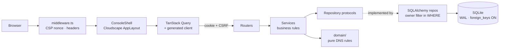
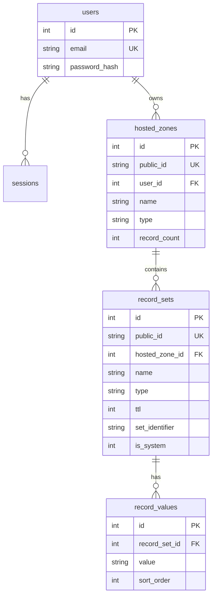

<div align="center">

# Route 53 Console Clone

**A working clone of the AWS Route 53 console — hosted zones and DNS records, end to end.**

Next.js · TypeScript · FastAPI · SQLite

<sub>⚠️ Not affiliated with Amazon Web Services. An educational UI/UX clone containing no AWS trademarked assets, performing no DNS resolution.</sub>

</div>

---

## Quick start

You need **Python 3.11+** and **Node.js 20+**. Two terminals.

**1 — Backend**

```bash
cd backend && python -m venv .venv && .venv/Scripts/pip install -e ".[dev]"
```

```bash
cd backend && .venv/Scripts/python -m uvicorn app.main:app --reload --port 8000
```

**2 — Frontend**

```bash
cd frontend && npm install
```

```bash
cd frontend && npm run dev
```

Open **http://localhost:3000** and sign in:

| Email | Password |
|---|---|
| `demo@route53clone.dev` | `DemoConsole2026` |

The database creates and seeds itself on boot — three zones with a spread of record types, so you never land on an empty screen. Seeding is idempotent, so restarting changes nothing.

> **API docs:** http://localhost:8000/docs · **Health:** http://localhost:8000/healthz

---

## What it does

| | |
|---|---|
| **Hosted zones** | Create, read, update, delete. Each new zone generates its SOA and apex NS records in one transaction — and both then refuse to be edited or deleted, exactly as in the real console. |
| **DNS records** | All nine common types — A, AAAA, CNAME, TXT, MX, NS, PTR, SRV, CAA — each validated server-side against its own rules. |
| **Real DNS rules** | A CNAME can't share a name with another record (in *either* direction) and can't sit at the zone apex. Record sets are unique on `(zone, name, type, set identifier)`. |
| **Console fidelity** | Shell, side navigation, tables with search, filters, sorting, pagination, column preferences, modals, and a stacked notification bar. |
| **Shareable views** | Search, filter, sort, and page live in the URL — so a filtered table is a link, and the back button goes back to the filter. |
| **Designed everywhere** | Dark mode, plus deliberate login, empty, loading, error, 404, and placeholder screens. |

---

## How it's built



Four backend layers, dependencies pointing inward only:

- **Routers** are thin — parse, delegate, return.
- **Services** hold every business rule and depend on repository *protocols*, never implementations.
- **Repositories** own persistence *and* authorization: every user-data query carries its owner filter in the SQL `WHERE` clause.
- **`domain/`** is pure functions with zero framework imports, so every DNS rule is testable without a database.

**The anti-drift trick:** CI exports `openapi.json` from the running app, regenerates the TypeScript client, and fails if the committed client differs. A breaking API change becomes a compile error instead of a broken page.

<details>
<summary><b>Database schema</b></summary>



**The decision that matters:** one row per *record set*, values in a child table, unique on `(hosted_zone_id, name, type, set_identifier)`.

Route 53 groups several values under one name and type, and weighted answers share a name and type while differing only by set identifier. Model one row per *value* and that uniqueness rule becomes impossible to express. → [ADR-0003](docs/adr/0003-record-set-model.md)

Internal integer keys never leave the database; the API exposes only `public_id`.

**Pragmas** are set on every connection, because SQLite scopes them per connection:

```sql
journal_mode = WAL      -- readers don't block the writer
synchronous  = NORMAL   -- correct pairing with WAL
foreign_keys = ON       -- OFF by default; without it every CASCADE is inert
busy_timeout = 5000
temp_store   = MEMORY
```

An integration test deletes a zone and asserts no orphaned records remain — so `foreign_keys = ON` can't be dropped unnoticed.

</details>

<details>
<summary><b>API reference</b></summary>

Versioned under `/api/v1`. Errors are RFC 9457 Problem Details with a correlation ID. Lists return `{ items, total, next_token }`.

| Method | Path | Notes |
|---|---|---|
| `POST` | `/auth/login` | Sets session + CSRF cookies · `429` when rate-limited |
| `POST` | `/auth/logout` | Deletes the session row, clears both cookies |
| `GET` | `/auth/me` | Drives session persistence across reloads |
| `GET` | `/hosted-zones` | `?search=&sort=&order=&limit=&offset=` · owner-scoped |
| `POST` | `/hosted-zones` | `201` · generates SOA + NS atomically · `409` on duplicate |
| `GET` | `/hosted-zones/{id}` | `404` if absent **or owned by someone else** |
| `PATCH` | `/hosted-zones/{id}` | Description only — a zone's name is its identity |
| `DELETE` | `/hosted-zones/{id}` | `409` while non-system records remain |
| `GET` | `/hosted-zones/{id}/records` | `?search=&type=&sort=&limit=&offset=` |
| `POST` | `/hosted-zones/{id}/records` | Body discriminated on `type` · `409` on uniqueness or CNAME rules |
| `PUT` | `/hosted-zones/{id}/records/{rid}` | `409` for generated records |
| `DELETE` | `/hosted-zones/{id}/records/{rid}` | `409` for generated records |
| `GET` | `/healthz` | Includes a database round trip |

Every operation carries a summary, description, `response_model`, documented errors, and per-record-type examples. `/docs` is disabled entirely in production.

**Regenerating the client** after an API change:

```bash
cd backend && python scripts/export_openapi.py ../frontend/openapi.json
```

```bash
cd frontend && npm run generate:api
```

</details>

---

## Testing

```bash
cd backend && .venv/Scripts/python -m pytest
```

**87 tests, all passing.**

- **Unit** — every record type's validator, name normalisation (punycode, wildcards, label limits), TTL bounds. No database, no HTTP client.
- **Integration** — a real temporary SQLite file, so WAL and the foreign-key pragma are genuinely exercised.

The one that matters most is [`test_authorization.py`](backend/tests/integration/test_authorization.py): a second account requests the first account's zone and record and gets **404, not 403** — because a 403 would confirm the identifier exists.

Frontend checks:

```bash
cd frontend && npm run typecheck && npm run build
```

---

## Security

Full detail in **[docs/SECURITY.md](docs/SECURITY.md)**. Headlines:

- 🔒 Owner scoping in the SQL `WHERE` clause of every user-data query, with a committed test proving cross-user isolation returns 404
- 🔑 Argon2id password hashing — including the seeded demo account
- 🍪 Opaque session tokens stored *hashed*, in `httpOnly` / `Secure` / `SameSite=Lax` cookies, plus a double-submit CSRF token
- 🛡️ Sort parameters are a `StrEnum` allowlist, so no client value reaches an `ORDER BY` unvalidated
- 🚫 Input schemas have no field for `user_id` or `is_system` — ownership can't be mass-assigned
- 📋 Nonce-based CSP, security headers in both layers, CORS allowlist, login rate limiting

---

## Decisions

Each ADR records context, the decision, alternatives rejected, and the consequences — including the bad ones.

| | |
|---|---|
| [ADR-0001](docs/adr/0001-ui-component-library.md) | Cloudscape for the console chrome |
| [ADR-0002](docs/adr/0002-layering.md) | Layering without a DI container or UnitOfWork |
| [ADR-0003](docs/adr/0003-record-set-model.md) | One row per record set |
| [ADR-0004](docs/adr/0004-cookie-sessions.md) | Cookie sessions over JWT |
| [ADR-0005](docs/adr/0005-sqlite-persistence.md) | SQLite persistence strategy |
| [ADR-0006](docs/adr/0006-generated-client.md) | A generated TypeScript client |
| [ADR-0007](docs/adr/0007-sync-sqlalchemy.md) | Synchronous SQLAlchemy over aiosqlite |

---

## Known limitations

Written honestly — what was left out matters as much as what was built.

<details>
<summary><b>Deliberately not built</b></summary>

- **No DNS resolution.** Records are stored and validated, never served. This is a console clone, not a name server.
- **Routing policies are modelled, not evaluated.** The schema and UI carry `routing_policy` and `set_identifier` — and the uniqueness constraint depends on the latter — but nothing weights or fails over, because nothing resolves.
- **Six console sections are placeholders.** Health checks, traffic flow, domains, resolver, applications, profiles. Each renders one designed page explaining what the real feature does and why it's out of scope.
- **Zone-file import/export.** Import is the most dangerous input surface here — `$INCLUDE` is a local-file-read primitive, and the parser needs size, line, and timeout limits. Cut rather than shipped unhardened.
- **No tags, no DNSSEC.** Both visible as tabs, both explain themselves.
- **No audit log, caching layer, event bus, or FTS5.** Each considered and rejected as unearned at this scale.

</details>

<details>
<summary><b>Accepted trade-offs</b></summary>

- **Search is `LIKE` with an index.** Correct at this volume. FTS5 is the documented scale path, not a present need.
- **Rate limiting is in-process.** Correct for one instance; Redis is the path behind multiple workers.
- **`style-src` permits inline styles.** Cloudscape injects component styles through the CSSOM at runtime, so a strict `style-src` breaks every control. `script-src` stays nonce-restricted, which is where the XSS risk lives.
- **Demo credentials are published on the login page.** A public demo behind credentials nobody has is useless. Mitigated by a low-privilege account, owner scoping, and rate limiting.
- **Authentication is local and mocked.** No IAM, no OAuth, no MFA — but passwords are Argon2id hashed regardless. "Mocked" means no identity provider, not permission to store plaintext.

</details>

<details>
<summary><b>Not yet done</b></summary>

- **Not deployed.** Runs locally, both halves verified end to end. Vercel + Fly.io remain — and Fly needs a persistent volume, since ephemeral filesystems destroy the SQLite file on every restart.
- **No end-to-end or component tests.** Backend coverage is real (87 tests); Playwright and Vitest are scaffolded but unwritten.
- **No Alembic migration committed.** The schema builds from SQLAlchemy metadata on first boot. Generate the first migration before any schema edit.

</details>

---

## Third-party dependencies

<details>
<summary><b>Full list with licences</b></summary>

| Dependency | Licence | Why |
|---|---|---|
| [Cloudscape](https://cloudscape.design/) | Apache 2.0 | The design system the real console is built from, open-sourced by AWS in 2022. Maximal fidelity on the first grading criterion. → [ADR-0001](docs/adr/0001-ui-component-library.md) |
| [Next.js](https://nextjs.org/) | MIT | Mandated. Nested layouts mirror the console shell |
| [FastAPI](https://fastapi.tiangolo.com/) | MIT | Mandated. Pydantic v2 validation, automatic OpenAPI |
| [SQLAlchemy](https://www.sqlalchemy.org/) | MIT | Parameterised by construction; typed `Mapped[]` |
| [Pydantic](https://docs.pydantic.dev/) | MIT | Discriminated unions give per-record-type validation |
| [argon2-cffi](https://argon2-cffi.readthedocs.io/) | MIT | Current best-practice password hashing |
| [structlog](https://www.structlog.org/) | MIT / Apache 2.0 | JSON logs with correlation IDs and credential redaction |
| [slowapi](https://github.com/laurentS/slowapi) | MIT | Login rate limiting |
| [TanStack Query](https://tanstack.com/query) | MIT | Cache invalidation, post-mutation notifications |
| [nuqs](https://nuqs.47ng.com/) | MIT | URL-backed table state with minimal code |
| [Zod](https://zod.dev/) | MIT | Discriminated union mirroring the server's rules |
| [Phosphor Icons](https://phosphoricons.com/) | MIT | Consistent vector icon set for the designed surfaces |
| [@hey-api/openapi-ts](https://heyapi.dev/) | MIT | Generates the client; makes drift a compile error → [ADR-0006](docs/adr/0006-generated-client.md) |

</details>

No AWS logo, wordmark, icon set, or documentation prose appears anywhere. The brand mark in [`BrandMark.tsx`](frontend/src/components/ui/BrandMark.tsx) and all help copy are original work.
