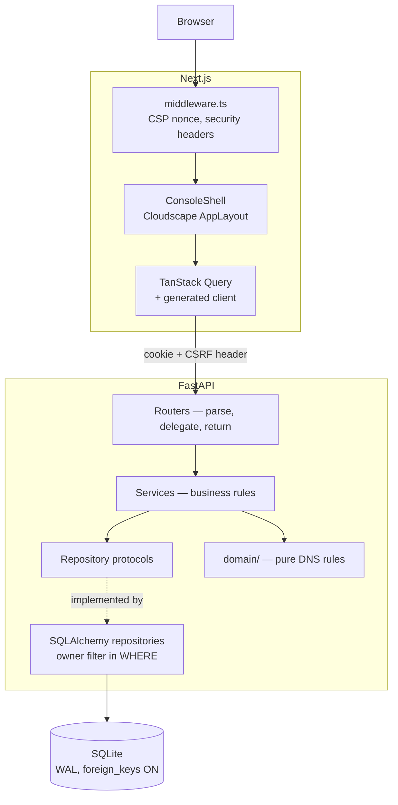
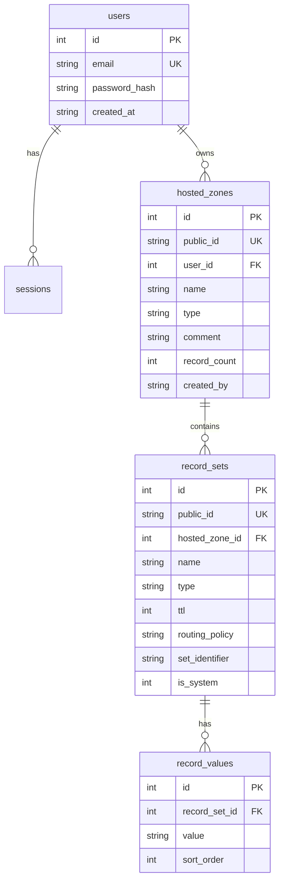

# Route 53 Console Clone

A functional clone of the AWS Route 53 console's hosted zone and DNS record
management, built from a specification as a take-home exercise.

> **Not affiliated with Amazon Web Services.** This is an educational UI/UX
> clone. It contains no AWS trademarked assets, and it performs no DNS
> resolution — records are stored and validated, not served.

---

## Demo

| | |
|---|---|
| **Application** | _not yet deployed — run locally with the instructions below_ |
| **Email** | `demo@route53clone.dev` |
| **Password** | `DemoConsole2026` |

The demo account is seeded with three hosted zones spanning every record type.
Its credentials are shown on the login page deliberately; see
[docs/SECURITY.md](docs/SECURITY.md) for why that is an accepted trade-off.

---

## What works

- **Hosted zones** — full CRUD. Creating one generates its SOA record and an
  apex NS record listing four name servers, in a single transaction. Both are
  read-only afterwards, as in the real console.
- **Records** — full CRUD across all nine common types (A, AAAA, CNAME, TXT, MX,
  NS, PTR, SRV, CAA), each validated server-side against its own rules.
- **The rules that make it a DNS manager** rather than a table editor: record
  sets unique on `(zone, name, type, set identifier)`; a CNAME may not coexist
  with any other record at its name, in either direction; a CNAME may not sit at
  the zone apex; generated records resist edit and delete.
- **Console fidelity** — the shell, side navigation, tables with search, type
  filters, sorting, pagination and column preferences, modals, and a stacked
  notification bar.
- **Table state in the URL**, so a filtered view is shareable and the back button
  returns to the previous filter rather than the previous page.
- **Dark mode**, and designed login, empty, loading, error, 404, and placeholder
  states.

---

## Architecture



Four backend layers, dependencies pointing inward only. Routers are thin.
Services hold every business rule and depend on repository *protocols*, never on
implementations. Repositories own persistence and authorization together — every
method reading user data takes an owner identifier and applies it in the SQL
`WHERE` clause. `domain/` is pure functions with no framework imports.

**Loose coupling, concretely:** CI exports `openapi.json` from the running
application, regenerates the TypeScript client from it, and typechecks the
frontend. A breaking contract change fails the build instead of surfacing as a
runtime error in the browser.

---

## Running it

### Requirements
Python 3.11+, Node.js 20+.

### Backend

```bash
cd backend
python -m venv .venv && ./.venv/Scripts/activate   # source .venv/bin/activate on macOS/Linux
pip install -e ".[dev]"
cp ../.env.example .env                            # then fill in the placeholders
uvicorn app.main:app --reload --port 8000
```

The database is created and seeded on boot. Seeding is idempotent, so restarting
neither duplicates nor destroys anything.

- API: <http://localhost:8000>
- Interactive docs: <http://localhost:8000/docs>

### Frontend

```bash
cd frontend
npm install
echo "NEXT_PUBLIC_API_BASE_URL=http://localhost:8000" > .env.local
npm run dev
```

Console: <http://localhost:3000>

### Regenerating the API client

```bash
cd backend && python scripts/export_openapi.py ../frontend/openapi.json
cd ../frontend && npm run generate:api
```

---

## Database



**The central decision** is one row per *record set*, with values in a child
table, unique on `(hosted_zone_id, name, type, set_identifier)`. Route 53 groups
multiple values under one name and type, and weighted answers share a name and
type while differing only by set identifier — so one row per value would make
that uniqueness rule inexpressible. See
[ADR-0003](docs/adr/0003-record-set-model.md).

Internal integer keys never leave the database. The API exposes only `public_id`,
which avoids publishing a sequential count of rows and mirrors Route 53's `Z...`
zone identifiers.

**Pragmas** are set on every connection, not once at startup, because SQLite
scopes them per connection: `journal_mode=WAL`, `synchronous=NORMAL`,
**`foreign_keys=ON`**, `busy_timeout=5000`, `temp_store=MEMORY`. Foreign keys are
off by default in SQLite; without that pragma every `ON DELETE CASCADE` in the
schema is silently inert. An integration test deletes a zone and asserts no
orphaned records remain, so the pragma cannot be dropped unnoticed.

---

## API

Versioned under `/api/v1`. Errors are RFC 9457 Problem Details with a
correlation ID. List endpoints return `{ items, total, next_token }`.

| Method | Path | Notes |
|---|---|---|
| `POST` | `/auth/login` | Sets the session and CSRF cookies. `429` when rate-limited |
| `POST` | `/auth/logout` | Deletes the session row and clears both cookies |
| `GET` | `/auth/me` | Drives session persistence across reloads |
| `GET` | `/hosted-zones` | `?search=&sort=&order=&limit=&offset=`, owner-scoped |
| `POST` | `/hosted-zones` | `201`; generates SOA and NS atomically; `409` on duplicate |
| `GET` | `/hosted-zones/{id}` | `404` if absent **or owned by someone else** |
| `PATCH` | `/hosted-zones/{id}` | Description only — a zone's name is its identity |
| `DELETE` | `/hosted-zones/{id}` | `409` while non-system records remain |
| `GET` | `/hosted-zones/{id}/records` | `?search=&type=&sort=&limit=&offset=` |
| `POST` | `/hosted-zones/{id}/records` | Body discriminated on `type`; `409` on uniqueness or CNAME rules |
| `GET` | `/hosted-zones/{id}/records/{rid}` | |
| `PUT` | `/hosted-zones/{id}/records/{rid}` | `409` for generated records |
| `DELETE` | `/hosted-zones/{id}/records/{rid}` | `409` for generated records |
| `GET` | `/healthz` | Includes a database round trip |

`/docs` is a deliverable — every operation has a summary, a description, a
declared `response_model`, documented error cases, and per-record-type examples.
It is disabled entirely in production.

---

## Testing

```bash
cd backend  && pytest                 # 87 tests
cd frontend && npm run typecheck
cd frontend && npm run build
```

**Unit tests** cover every record type's validator, name normalisation including
punycode and wildcard placement, and TTL bounds — against `domain/`, with no
database or HTTP client, which is the whole reason that package has no framework
imports.

**Integration tests** run against a real temporary SQLite file so WAL mode and
the foreign-key pragma are genuinely exercised. They cover zone creation with its
generated records, both directions of the CNAME coexistence rule, apex
rejection, system-record immutability, record-count maintenance, relative-name
qualification, pagination, and the sort-column allowlist.

The most important one is `tests/integration/test_authorization.py`: a second
account requests the first account's zone and record and receives **404, not
403**, because a 403 would confirm the identifier exists.

---

## Security

Full detail in [docs/SECURITY.md](docs/SECURITY.md). The headlines:

- Owner scoping in the SQL `WHERE` clause of every user-data query, with a
  committed test proving cross-user isolation returns 404.
- Argon2id password hashing, including the seeded demo account.
- Opaque session tokens stored hashed, in `httpOnly` / `Secure` / `SameSite=Lax`
  cookies, plus a double-submit CSRF token.
- Sort parameters are a `StrEnum` allowlist, so no client value reaches an
  `ORDER BY` clause unvalidated.
- Separate input schemas with no field for `user_id` or `is_system`, so ownership
  and system flags cannot be mass-assigned.
- Nonce-based CSP, security headers in both layers, CORS allowlist, login rate
  limiting.

---

## Third-party dependencies

| Dependency | Licence | Why |
|---|---|---|
| [Cloudscape](https://cloudscape.design/) | Apache 2.0 | The design system the real console is built from; open-sourced by AWS in July 2022. Maximal fidelity on the first grading criterion. See [ADR-0001](docs/adr/0001-ui-component-library.md) |
| [Next.js](https://nextjs.org/) | MIT | Mandated. Nested layouts mirror the console shell |
| [FastAPI](https://fastapi.tiangolo.com/) | MIT | Mandated. Pydantic v2 validation and automatic OpenAPI |
| [SQLAlchemy](https://www.sqlalchemy.org/) | MIT | Parameterised by construction; typed `Mapped[]` declarations |
| [Pydantic](https://docs.pydantic.dev/) | MIT | Discriminated unions give per-record-type request validation |
| [argon2-cffi](https://argon2-cffi.readthedocs.io/) | MIT | Current best-practice password hashing |
| [structlog](https://www.structlog.org/) | MIT / Apache 2.0 | JSON logging with correlation IDs and credential redaction |
| [slowapi](https://github.com/laurentS/slowapi) | MIT | Login rate limiting |
| [TanStack Query](https://tanstack.com/query) | MIT | Cache invalidation and post-mutation notifications |
| [nuqs](https://nuqs.47ng.com/) | MIT | URL-backed table state with minimal code |
| [Zod](https://zod.dev/) | MIT | Discriminated union mirroring the server's per-type rules |
| [@hey-api/openapi-ts](https://heyapi.dev/) | MIT | Generates the client; makes drift a compile error. See [ADR-0006](docs/adr/0006-generated-client.md) |

No AWS logo, wordmark, icon set, or documentation prose appears anywhere. The
brand mark in `src/components/ui/BrandMark.tsx` and the help text throughout are
original work.

---

## Decisions

Each records context, the decision, alternatives rejected, and consequences
including the negative ones.

- [ADR-0001 — Cloudscape for the console chrome](docs/adr/0001-ui-component-library.md)
- [ADR-0002 — Layering without a DI container or UnitOfWork](docs/adr/0002-layering.md)
- [ADR-0003 — One row per record set](docs/adr/0003-record-set-model.md)
- [ADR-0004 — Cookie sessions over JWT](docs/adr/0004-cookie-sessions.md)
- [ADR-0005 — SQLite persistence strategy](docs/adr/0005-sqlite-persistence.md)
- [ADR-0006 — A generated TypeScript client](docs/adr/0006-generated-client.md)
- [ADR-0007 — Synchronous SQLAlchemy over aiosqlite](docs/adr/0007-sync-sqlalchemy.md)

---

## Known limitations and trade-offs

Written honestly, because what was consciously left out matters as much as what
was built.

**Not built, deliberately:**

- **No DNS resolution.** Records are stored and validated, never served. This is
  a console clone, not a name server.
- **Routing policies are modelled but not evaluated.** The schema and UI carry
  `routing_policy` and `set_identifier`, and the uniqueness constraint depends on
  the latter — but nothing weights or fails over, because nothing resolves.
- **Six console sections are placeholders.** Health checks, traffic flow,
  domains, resolver, applications, and profiles each render one designed Coming
  Soon page stating what the real feature does and why it is out of scope. Health
  checking would require probing real endpoints; domain registration involves a
  registrar and real payments.
- **Zone-file import and export are not built.** Import is the most dangerous
  input surface in an application like this — `$INCLUDE` is a local-file-read
  primitive, and the parser needs size, line, and timeout limits. The
  specification's own guidance is to cut it rather than ship it unhardened, and
  that is what I did.
- **No tags, no DNSSEC.** Both are visible as tabs, both explain themselves.
- **No audit log, no caching layer, no event bus, no FTS5.** Each was considered
  and rejected as unearned at this scale. Knowing when not to reach for a tool is
  the point.

**Accepted trade-offs:**

- **Search is `LIKE` with an index.** Correct at this data volume. FTS5 is the
  documented scale path, not a present need.
- **Rate limiting is in-process.** Correct for one instance; behind multiple
  workers each keeps its own tally, and Redis is the path.
- **`style-src` permits inline styles.** Cloudscape injects component styles
  through the CSSOM at runtime, so a strict `style-src` breaks every control.
  `script-src` stays nonce-restricted, which is where the XSS risk lives.
- **Demo credentials are published on the login page.** A public demo behind
  credentials nobody has is useless. Mitigated by a low-privilege account, owner
  scoping, and rate limiting.
- **Authentication is local and mocked.** No IAM, no OAuth, no MFA. "Mocked" was
  taken to mean the absence of a real identity provider, not permission to store
  plaintext — passwords are Argon2id hashed regardless.
- **Responsive down to tablet, not phone.** The real console is desktop-first;
  this degrades gracefully rather than perfectly.

**Not yet done:**

- **Not deployed.** The application runs locally, backend and frontend both
  verified end to end. Vercel and Fly.io configuration is the remaining step, and
  Fly needs a persistent volume — free tiers with ephemeral filesystems destroy
  the SQLite file on every restart.
- **No end-to-end or component tests yet.** Backend coverage is real (87 tests);
  Playwright and Vitest suites are scaffolded in `package.json` but not written.
- **No Alembic migration committed.** The schema is created from the SQLAlchemy
  metadata on first boot. Alembic is configured as the mechanism for schema
  *changes*, and the first migration should be generated before any schema edit.
- **No CI workflow committed yet.**
